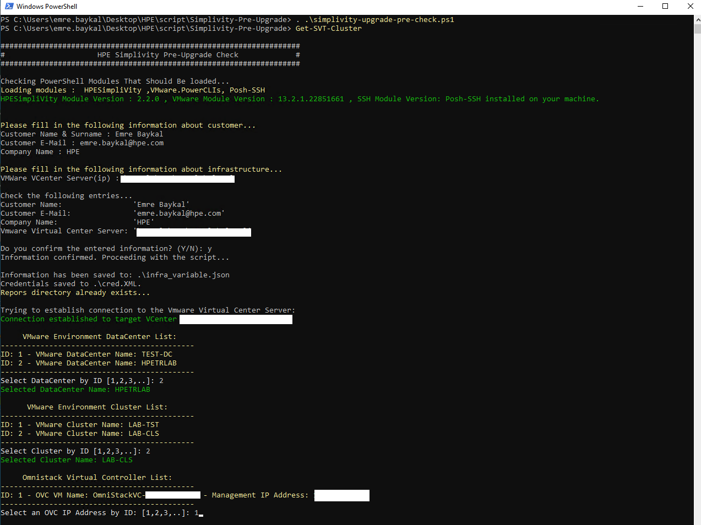
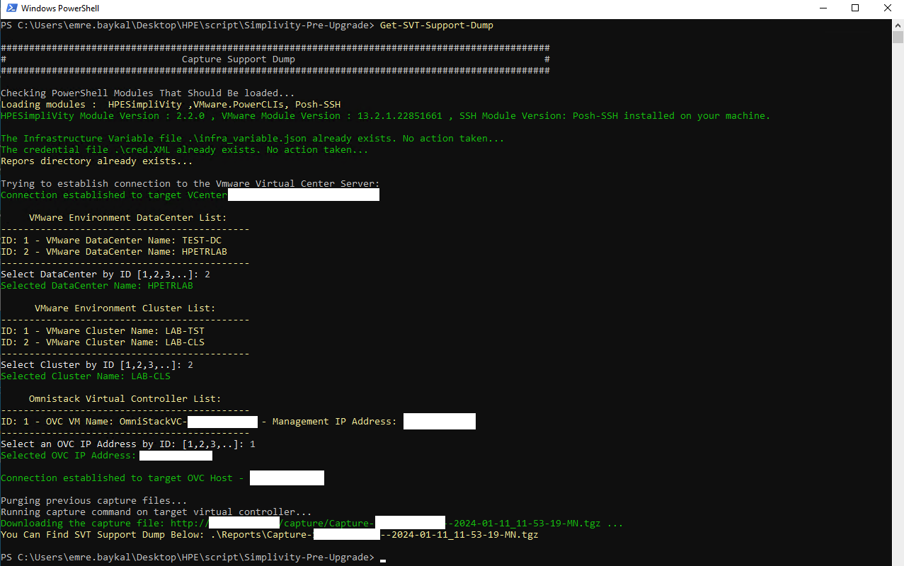

# PowerShell Script for Simplivity Cluster Analysis in VMware vCenter Environment

## Overview

This PowerShell script performs pre-upgrade checks on HPE SimpliVity servers to ensure system readiness for upgrades, targeting system administrators of HPE SimpliVity environments. It retrieves information about the hosts, checks various metrics, and generates a comprehensive report for administrators.

AUTHOR  : Emre Baykal - HPE Services

## Features

- **Cluster Health Checks**: Verifies the operational state of SimpliVity clusters.

- **Host and VM Analysis**: Assesses the health and configuration of VMs and hosts.

- **Hardware Health Checks:** Performs checks for various factors, including host connectivity, upgrade status, disk health, software version compatibility, and hardware status.

- **Update Manager System Requirements Check:** Evaluates the operating system that Simplivity Update Manager run, installed Java version, and Microsoft .NET Framework version on the machine.

- **Automatic Report Generation**: Generates detailed logs and reports.

- **Support Dump Capture**: Captures and downloads dumps from OmniStack Virtual Controllers.

- **Uploading Report Files To FTP**: Can be uploaded report files to the FTP accounts issued for the client.

## How to Use

1. **Prerequisites:**
   - PowerShell v5.1 or later
   - PowerShell with administrative rights.
   - Required Modules: HPESimpliVity, VMware.VimAutomation.Core, Posh-SSH .
   - VMware vCenter and SimpliVity cluster administrative credentials.

2. **Installation and Setup**
   - Install Required Modules: Install-Module -Name HPESimpliVity, VMware.VimAutomation.Core, Posh-SSH.
   - Import Installed Modules: Import-Module HPESimpliVity, VMware.VimAutomation.Core, Posh-SSH
   - Script Execution: Run in PowerShell with administrative privileges.

3. **Execution:**
   - Run the script using a PowerShell console or script execution environment. When the script is run, it loads the modules required for analysis into the system.
     ```powershell
     . .\simplivity-pre-upgrade-check.ps1
     ```
   - Scirpt is divided into functions, if you want to run analysis on SimpliVity cluster and SVT hosts connected to this cluster, the following module will be called.
     ```powershell
     Get-SVT-Cluster
     ```
   - If prompted, provide necessary infrastructure and authentication details for environment.
   - If you only want to capture Simplivity Support Dump , the following module will be called.
     ```powershell
     Get-SVT-Support-Dump
     ``` 
   - If you only want to analyze the requirements on the host where the update manager will be run, the following module will be called.
     ```powershell
     Get-Update-Manager
     ``` 
   - If you  want to upload generated reports to the FTP accounts issued for the client.
     ```powershell
     Upload-Report-Files
     ``` 

4. **Script Workflow:**
   - Module Verification: Checks and loads necessary modules.
   - Credential and Infrastructure Setup: Enter VMware vCenter server details and credentials.
   - Cluster and Host Analysis: Performs checks for upgrade readiness.
   - Support Dump Management: Captures and downloads support dumps.
   - Report Generation: Creates reports in specified directories.
   - Uploading report files to FTP Server: After the script is run, the generated reports can be uploaded to the FTP accounts issued for the client.

5. **Output:**
   - The script will provide real-time console output.
   - A detailed culster report file (`Cluster-Name-Date.log` by default) will be generated in the Reports directory.
   - A detailed SVT hosts report file (`SVT-Host-Name-Date.log` by default) will be generated in the Reports directory.
   - Replication distribution csv file (`replica_distribution_file_Cluster-Name.csv` by default) will be generated in the Reports directory.
   - Support Dump file (`support-dump.tar` by default) will be generated in the Reports directory.

6. **Troubleshooting**
   - Ensure all modules are installed and loaded.
   - Verify credential and server detail inputs.
   - Check for administrative privileges.

6. **Screenshots**
   - Analysis on SimpliVity cluster and SVT hosts

   

   - Get Support Dump

   

## Notes
  
- This script assumes connectivity to a VMware vCenter Server and proper authentication.
- Review the script output and generated report for actionable insights and potential issues.
- For more details and troubleshooting information, refer to the [full script documentation](https://github.com/emrbaykal/PowerShell/blob/main/README.md).

## Issues and Contributions

- If you encounter any issues or have suggestions for improvements, please [open an issue](https://github.com/emrbaykal/PowerShell/issues).
- Contributions are welcome! Feel free to fork the repository and submit pull requests.

## License

This script is licensed under the [Apache 2.0](LICENSE).
